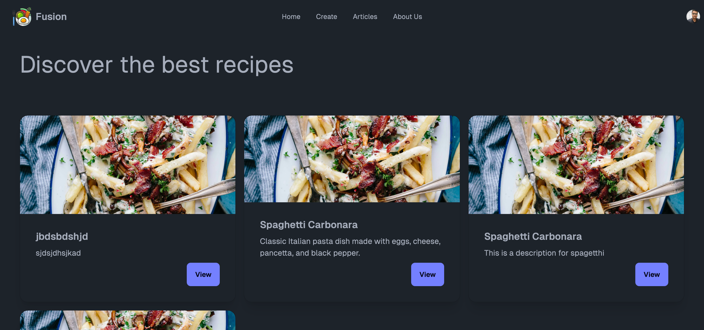

# Fusion - Recipe Sharing Platform

Fusion is a web application that allows users to share and discover recipes from around the world. Whether you're a seasoned chef or just starting out in the kitchen, Fusion provides a platform to explore a wide variety of recipes, create your own, and engage with a vibrant community of food enthusiasts.



## Features

- **Recipe Creation:** Easily create and share your favorite recipes with the community.
- **Recipe Discovery:** Explore a diverse range of recipes uploaded by other users.
- **Search Functionality:** Quickly find recipes based on title, ingredients, or categories.
- **User Authentication:** Secure authentication system to protect user accounts and data.
- **User Profiles:** Customize your profile, view your recipes, and see your activity.
- **Recipe Categories:** Browse recipes by categories such as Appetizers, Main Courses, Desserts, and more.
- **Responsive Design:** Enjoy a seamless experience across devices, from desktop to mobile.

## Technologies Used

- **Frontend:** React.js, Next.js, Tailwind CSS
- **Backend:** Node.js, Express.js, Prisma ORM
- **Database:** PostgreSQL
- **Authentication:** Clerk (Clerk is a service for user authentication and identity management.)
- **Deployment:** Vercel (Frontend), Heroku (Backend)
- **Version Control:** Git, GitHub

## Installation

To run the project locally, follow these steps:

1. Clone the repository:

```bash
git clone https://github.com/your-username/fusion.git
